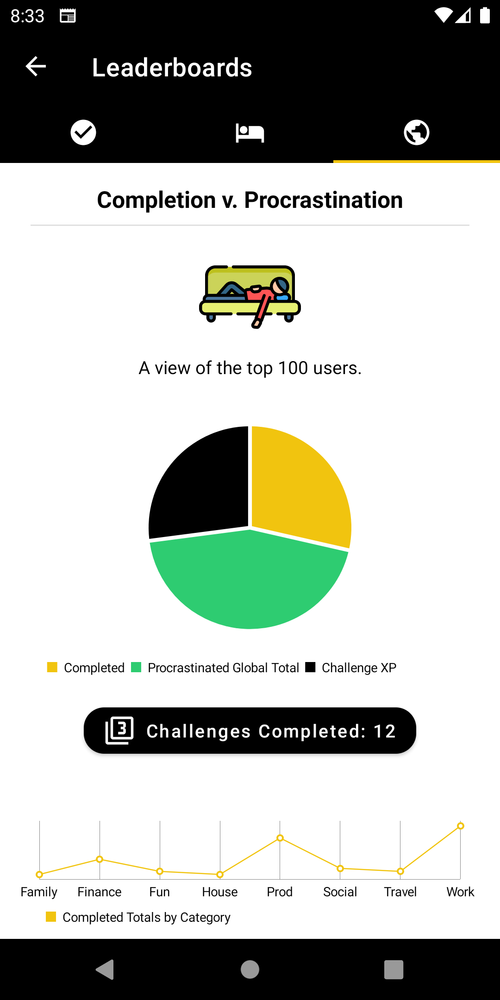

# procras_todo_how_to
Procras-ToDo information and how to guide.

Do you know how much you procrastinate? That is, how many times you delay, put off or ignore something that has to be done until the very last minute. Do you know which tasks you're more likely to complete right away, and which tasks you are like to want to put aside for as long as possible. 

When I in school, I would always wait until the morning of class to finish homework or coursework that was due that day. I had convinced myself that by waiting this long I would force myself to remember the content of the previous lesson and this would help me to remember the content in the long term. I got to the point where I would finish work minutes before it was due, talk about fresh out of the oven. 

For the most part, it worked, I often managed to remember most of what I needed. But if that is true, then is procratinating a bad thing? Do we do it because we're challenging or daring ourselves to see how close we can get to the deadline before actually working on something that has to be done by a certain time or date? Or, is it because we genuinely don't want to do something so we'll come up with any excuse to keep from doing it. 

Wouldn't it be nice to in addition to keep track of things to do, have a way to see which things we tend to procratinate and which things we take care of right away? Well now you can with ProcrasToDo. Furthermore, you can not only start to see a pattern in your activities, but also compare yourself to other users of the application globally. 

Navigation

Main Screen

   

After successfully signing into ProcrasToDo, you will arrive at the main screen. From here you can add tasks by tapping the plus button. On the top there is an options menu with: settings, about and log out options. The about menu option will take you to another screen where the app feastures are also explained. The circular graph symbol on the top right menu will take you to your personal statistics page. 

My ToDo List

     

ToDos will appear on the main list along with useful information about them. The circle on the left illustrates the important level from low to high, the smaller circle on the right is for the ToDo category (there are 8 to choose from when adding a ToDo). In the center, you will see the ToDo title, description, and due date. If the due date is today, you will also see a flashing alarm clock, tap the alarm clock to snooze the ToDo for 1 day. You can edit the ToDo by clicking on it or delete it by swiping it away from the list.

My Stats

   

User statistics are what make ProcrasToDo different. Here you can find out more about your habits around completing or procrastinating certain things. The categories that you set when you add a ToDo, will show what you like and dislike based on your activity levels, as well as which ones are taking the most of your time. 

From top to bottom the statistics are broken down into 4 cards. The first card contains the username and a snapshot of how you are doing overall. You will see your procrastination avg. per completion, your most and least procrastinated categories. In the center of the card, there is an icon that changes based on your procrastination avg. Below that you will find some words of encouragement. 

Challenges can be found below, challenges reward the user for good completion patterns and elevate your points on the leaderboards. The challenges will change periodically. if you miss a day on the challenge streak, the date button will turn red. You can get back on track by clicking on the red button. 

The procrastination v. completion card offers the total and breakdowns of your activity. At the bottom of the card, you can also see you completed totals, most and least active categories. Next, we have the insights card. Some insights are pretty obvious and visible right away and some take time to unlock. 

 There is also a link to the ProcrasToDo blog. 
 
 

Leaderboards

         

The leaderboards allow users to compete against their peers. Completion and procrastination totals are tallied up and the top 100 users will find themselves on the completion or the procrastination leaderboard depending on what they excel at. Completing challenges will boost your completion score allowing you to rise to the top faster.

Notifications

 

Get notified about your due items for the day. Enabling the widget also enables periodic notifications throughout the day help you stay focused and complete your goals. 

Enjoy!

